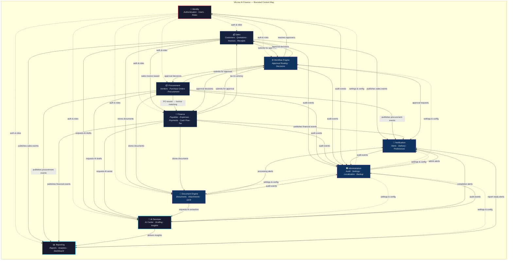

# VArrow AI Finance — System Architecture

| | |
|---|---|
| **Project Name** | VArrow AI Finance |
| **Company** | VArrow.tech |
| **Document Type** | System Architecture — Bounded Context Map |
| **Architecture Style** | Modular Monolith (per ADR-001) |
| **Deployment Model** | Single Company (Internal Platform, not SaaS) |
| **Status** | Final |
| **Date** | 2026-07-17 |

---

## About This Document

This document defines the **logical system architecture** of VArrow AI Finance using Domain-Driven Design (DDD) bounded contexts. It establishes the authoritative map of how the platform's 36 business modules are organized into 10 bounded contexts, how those contexts interact, and how events flow between them.

This document describes **logical architecture only**. It intentionally contains no cloud service selection, database implementation, or API specification. Those concerns are governed by their respective documents.

### Governing References

| Document | Location |
|---|---|
| Product Vision | [VISION.md](../01-vision/VISION.md) |
| Business Module Catalog | [BUSINESS_MODULE_CATALOG.md](../02-brd/BUSINESS_MODULE_CATALOG.md) |
| Technology Stack (ADR-001) | [ADR-001-technology-stack.md](../04-adr/ADR-001-technology-stack.md) |

### Architecture Style

Per ADR-001, VArrow AI Finance is a **modular monolith**. Bounded contexts defined here correspond to NestJS module groups within a single deployable application. Each context maintains clear internal boundaries, owns its data, and communicates with other contexts through well-defined events and synchronous queries. These boundaries are deliberately designed to support a future incremental migration to microservices if scale or organizational needs justify it.

---

## Bounded Context Index

| # | Bounded Context | Primary Domain |
|---|---|---|
| 1 | [Identity](#1-identity) | Authentication, Users, Roles, Access Control |
| 2 | [Sales](#2-sales) | Customers, Quotations, Sales Invoices, Receipts |
| 3 | [Procurement](#3-procurement) | Vendors, Purchase Orders, Procurement Coordination |
| 4 | [Finance](#4-finance) | Purchase Invoices, Expenses, Payments, Petty Cash, Cash Flow, Tax, Currency, Project Profitability |
| 5 | [Workflow Engine](#5-workflow-engine) | Approval Workflow, Workflow Rules, Routing |
| 6 | [Document Engine](#6-document-engine) | Document Management, Attachments, OCR & Document Processing |
| 7 | [AI Services](#7-ai-services) | AI Center, AI-Assisted Workflows, Bilingual AI |
| 8 | [Reporting](#8-reporting) | Reports, Financial Analytics, Dashboard |
| 9 | [Notification](#9-notification) | Notifications, Delivery Channels, Preferences |
| 10 | [Administration](#10-administration) | System Administration, Settings, Audit Logs, Localization, Backup & Recovery |

---

## Module-to-Context Mapping

The following table maps every business module from the [Business Module Catalog](../02-brd/BUSINESS_MODULE_CATALOG.md) to its owning bounded context.

| # | Business Module | Owning Bounded Context |
|---|---|---|
| 1 | Authentication | Identity |
| 2 | User Management | Identity |
| 3 | Roles & Permissions | Identity |
| 4 | Customers | Sales |
| 5 | Vendors | Procurement |
| 6 | Contacts | Sales / Procurement (shared concern) |
| 7 | Products | Sales / Procurement (shared catalog) |
| 8 | Services | Sales / Procurement (shared catalog) |
| 9 | Quotations | Sales |
| 10 | Purchase Orders | Procurement |
| 11 | Sales Invoices | Sales |
| 12 | Purchase Invoices | Finance |
| 13 | Expenses | Finance |
| 14 | Petty Cash | Finance |
| 15 | Payments | Finance |
| 16 | Receipts | Sales |
| 17 | Approval Workflow | Workflow Engine |
| 18 | Document Management | Document Engine |
| 19 | Attachments | Document Engine |
| 20 | Dashboard | Reporting |
| 21 | Reports | Reporting |
| 22 | Notifications | Notification |
| 23 | Audit Logs | Administration |
| 24 | Settings | Administration |
| 25 | AI Center | AI Services |
| 26 | OCR & Document Processing | Document Engine |
| 27 | Procurement | Procurement |
| 28 | Financial Analytics | Reporting |
| 29 | Cash Flow | Finance |
| 30 | Project Profitability | Finance |
| 31 | Multi Currency | Finance |
| 32 | Tax & VAT | Finance |
| 33 | Localization | Administration |
| 34 | Employee Expenses | Finance |
| 35 | Backup & Recovery | Administration |
| 36 | System Administration | Administration |

> **Shared Catalog Note:** Products, Services, and Contacts are shared reference data. They are physically owned as a shared catalog module accessible to both Sales and Procurement, but neither context mutates the other's master data. Each context holds a read-optimized local view of the catalog entries it needs.

---

# 1. Identity

## Purpose

Establish and govern who users are, how they authenticate, what they are allowed to do, and how their access is controlled across the entire platform.

## Responsibilities

- Authenticate users and manage sessions across web and mobile.
- Manage the lifecycle of user accounts — creation, activation, deactivation, and offboarding.
- Define roles and group permissions into coherent access profiles.
- Assign roles to users and enforce permission boundaries.
- Ensure separation of duties for financial operations.
- Record authentication and access events for accountability.

## Owned Business Modules

| Module | Role Within Context |
|---|---|
| Authentication | Gateway — session creation, identity verification, sign-in/out |
| User Management | Directory — user account lifecycle and profile maintenance |
| Roles & Permissions | Authorization — role definition, permission grouping, role assignment |

## External Dependencies

| Dependency | Nature |
|---|---|
| Administration (Audit Logs) | Identity publishes authentication and access events for audit recording |
| Administration (Settings) | Reads platform-level security configuration (session policies, password policies) |
| Notification | Triggers notifications on sign-in anomalies, account changes, and role updates |

## Events Published

| Event | Description | Consumed By |
|---|---|---|
| `UserAuthenticated` | A user has successfully signed in | Administration, Reporting |
| `AuthenticationFailed` | A sign-in attempt was denied | Administration, Notification |
| `UserCreated` | A new user account has been created | Notification, Administration |
| `UserDeactivated` | A user account has been deactivated | Workflow Engine, Administration, Notification |
| `UserUpdated` | A user profile has been modified | Administration |
| `RoleAssigned` | A role has been assigned to a user | Workflow Engine, Administration |
| `RoleRevoked` | A role has been removed from a user | Workflow Engine, Administration |
| `PermissionsChanged` | A role's permissions have been modified | Workflow Engine, Administration |

## Events Consumed

| Event | Source | Purpose |
|---|---|---|
| `SettingsUpdated` | Administration | Refreshes security-related configuration (session timeout, password rules) |

## Future Scalability

- **Independent extraction:** Identity is the most self-contained context and the strongest candidate for extraction into an independent service if the platform migrates toward microservices.
- **External identity provider integration:** The context boundary is designed to allow future integration with external identity providers or single sign-on systems without affecting other contexts.
- **Adaptive access policies:** The permissions model supports future extension to risk-based or attribute-based access control.

## Interactions with Other Contexts

```
Identity ──publishes auth events──► Administration
Identity ──publishes auth events──► Notification
Identity ──provides user/role data──► Workflow Engine (approver resolution)
Identity ──provides user/role data──► Reporting (permission-aware reports)
Identity ──provides user/role data──► All Contexts (authorization checks)
Identity ◄──reads settings────────── Administration
```

---

# 2. Sales

## Purpose

Manage the company's revenue-facing operations — from quoting customers to invoicing and collecting receipts.

## Responsibilities

- Maintain the customer master directory and customer contacts.
- Create, revise, approve, and issue quotations.
- Create, approve, and issue sales invoices, including tax and currency handling via Finance context.
- Record and track customer receipts (incoming payments).
- Manage shared catalog references for products and services used in sales documents.
- Drive the quotation-to-invoice conversion lifecycle.

## Owned Business Modules

| Module | Role Within Context |
|---|---|
| Customers | Master data — customer directory and lifecycle |
| Contacts (Sales side) | Reference — contact persons linked to customers |
| Products (read access) | Shared catalog — product references used in quotations and invoices |
| Services (read access) | Shared catalog — service references used in quotations and invoices |
| Quotations | Transaction — creation, revision, approval, and issuance of price offers |
| Sales Invoices | Transaction — billing customers for delivered goods and services |
| Receipts | Transaction — recording incoming customer payments |

## External Dependencies

| Dependency | Nature |
|---|---|
| Workflow Engine | Routes quotations and sales invoices through approval workflows |
| Document Engine | Stores and manages attachments and generated documents for sales records |
| Finance (Tax & VAT) | Provides tax calculations and currency handling for invoices |
| Finance (Multi Currency) | Provides currency conversion and presentation for multi-currency sales |
| Notification | Delivers notifications on quotation status, invoice issuance, and overdue events |
| AI Services | Provides AI-assisted quotation drafting and invoice generation |
| Identity | Provides authorization checks for all sales operations |
| Reporting | Receives sales data for reports and dashboards |

## Events Published

| Event | Description | Consumed By |
|---|---|---|
| `QuotationCreated` | A new quotation has been drafted | Workflow Engine, Notification, Administration |
| `QuotationApproved` | A quotation has been approved | Notification, Reporting |
| `QuotationAccepted` | A customer has accepted a quotation | Notification, Reporting |
| `QuotationExpired` | A quotation has passed its validity date | Notification, Reporting |
| `SalesInvoiceIssued` | A sales invoice has been issued to a customer | Finance, Workflow Engine, Notification, Reporting, Administration |
| `SalesInvoiceOverdue` | A sales invoice has exceeded its due date | Notification, Reporting, Finance |
| `SalesInvoicePaid` | A sales invoice has been fully settled | Finance, Reporting, Notification |
| `ReceiptRecorded` | A customer payment has been received | Finance, Reporting, Notification |
| `CustomerCreated` | A new customer record has been created | Notification, Administration |
| `CustomerUpdated` | A customer record has been modified | Administration |

## Events Consumed

| Event | Source | Purpose |
|---|---|---|
| `ApprovalDecisionMade` | Workflow Engine | Updates quotation/invoice status based on approval outcome |
| `TaxCalculated` | Finance | Applies computed tax amounts to sales invoices |
| `CurrencyRateResolved` | Finance | Applies currency conversion for multi-currency sales |
| `DocumentProcessed` | Document Engine | Receives processed document data for customer records |
| `AISuggestionReady` | AI Services | Receives AI-generated drafts for quotations or invoices |

## Future Scalability

- **Sales pipeline depth:** The context boundary supports future addition of sales orders, credit notes, and debit notes as intermediate documents in the quotation-to-receipt lifecycle.
- **Customer segmentation:** Customer management can be extended with segmentation, grouping, and relationship insights without affecting other contexts.
- **Independent scaling:** Sales is a high-transaction context and a strong candidate for independent scaling if the platform migrates to microservices.

## Interactions with Other Contexts

```
Sales ──submits for approval──────► Workflow Engine
Sales ──requests tax calculation──► Finance
Sales ──requests currency rates───► Finance
Sales ──publishes sales events────► Reporting
Sales ──publishes sales events────► Notification
Sales ──publishes sales events────► Administration (audit)
Sales ──stores/retrieves docs─────► Document Engine
Sales ──requests AI assistance────► AI Services
Sales ◄──receives approval results── Workflow Engine
Sales ◄──receives tax/currency──── Finance
```

---

# 3. Procurement

## Purpose

Manage the company's purchasing operations — from selecting vendors to issuing purchase orders and coordinating the procurement lifecycle.

## Responsibilities

- Maintain the vendor master directory and vendor contacts.
- Create, approve, and issue purchase orders.
- Coordinate end-to-end procurement activity and vendor compliance.
- Manage shared catalog references for products and services used in purchasing documents.
- Drive the procurement-to-purchase-invoice handoff to the Finance context.

## Owned Business Modules

| Module | Role Within Context |
|---|---|
| Vendors | Master data — vendor directory and lifecycle |
| Contacts (Procurement side) | Reference — contact persons linked to vendors |
| Products (read access) | Shared catalog — product references used in purchase orders |
| Services (read access) | Shared catalog — service references used in purchase orders |
| Purchase Orders | Transaction — formal purchasing requests to vendors |
| Procurement | Coordination — end-to-end procurement oversight and compliance |

## External Dependencies

| Dependency | Nature |
|---|---|
| Workflow Engine | Routes purchase orders through approval workflows |
| Document Engine | Stores and manages attachments for purchase records |
| Finance | Receives purchase orders for invoice matching and payment |
| Notification | Delivers notifications on PO status and procurement milestones |
| AI Services | Provides AI-assisted purchase order creation |
| Identity | Provides authorization checks for all procurement operations |
| Reporting | Receives procurement data for reports and dashboards |

## Events Published

| Event | Description | Consumed By |
|---|---|---|
| `PurchaseOrderCreated` | A new purchase order has been drafted | Workflow Engine, Notification, Administration |
| `PurchaseOrderApproved` | A purchase order has been approved | Notification, Finance, Reporting |
| `PurchaseOrderIssued` | A purchase order has been sent to a vendor | Finance, Notification, Reporting, Administration |
| `VendorCreated` | A new vendor record has been created | Notification, Administration |
| `VendorUpdated` | A vendor record has been modified | Administration |
| `ProcurementMilestoneReached` | A significant procurement event has occurred | Notification, Reporting |

## Events Consumed

| Event | Source | Purpose |
|---|---|---|
| `ApprovalDecisionMade` | Workflow Engine | Updates purchase order status based on approval outcome |
| `PurchaseInvoiceRecorded` | Finance | Links purchase invoices back to originating purchase orders |
| `PaymentCompleted` | Finance | Updates procurement status when vendor payment is settled |
| `AISuggestionReady` | AI Services | Receives AI-generated drafts for purchase orders |

## Future Scalability

- **Vendor performance:** The context supports future vendor scoring, performance tracking, and preferred vendor designation.
- **Purchase requisitions:** An intermediate requisition step can be introduced before purchase orders without restructuring context boundaries.
- **Three-way matching:** The handoff to Finance is designed to support future three-way matching (PO, receipt, invoice) as the procurement process matures.

## Interactions with Other Contexts

```
Procurement ──submits for approval──► Workflow Engine
Procurement ──publishes PO events───► Finance (for invoice matching)
Procurement ──publishes PO events───► Notification
Procurement ──publishes PO events───► Reporting
Procurement ──publishes PO events───► Administration (audit)
Procurement ──stores/retrieves docs─► Document Engine
Procurement ──requests AI assistance► AI Services
Procurement ◄──receives approval────── Workflow Engine
Procurement ◄──receives invoice link── Finance
Procurement ◄──receives payment info── Finance
```

---

# 4. Finance

## Purpose

Manage the company's financial obligations, payments, cash position, tax compliance, currency handling, and profitability analysis.

## Responsibilities

- Record and manage purchase invoices received from vendors, including matching to purchase orders.
- Record and manage company expenses and employee expense reimbursements.
- Manage petty cash funds, disbursements, and reconciliation.
- Process and track outgoing payments to vendors and other payees.
- Provide cash flow visibility — inflows and outflows consolidated.
- Apply and track tax and VAT on financial documents.
- Handle multi-currency transactions, conversion, and reporting presentation.
- Assess project-level profitability by associating revenue and costs.

## Owned Business Modules

| Module | Role Within Context |
|---|---|
| Purchase Invoices | Transaction — recording vendor invoices and matching to purchase orders |
| Expenses | Transaction — recording and categorizing company expenditures |
| Employee Expenses | Transaction — employee expense submission, approval, reimbursement |
| Petty Cash | Transaction — small cash fund management and reconciliation |
| Payments | Transaction — outgoing payments to settle obligations |
| Cash Flow | Analysis — consolidated inflow/outflow visibility and liquidity |
| Tax & VAT | Rules — tax calculation, application, and compliance tracking |
| Multi Currency | Rules — currency handling, conversion, and presentation |
| Project Profitability | Analysis — project-level revenue vs. cost assessment |

## External Dependencies

| Dependency | Nature |
|---|---|
| Procurement | Receives purchase order references for invoice matching |
| Sales | Receives sales invoice and receipt data for cash flow and profitability |
| Workflow Engine | Routes purchase invoices, expenses, and payments through approval workflows |
| Document Engine | Stores supporting attachments for invoices, expenses, and payments |
| Notification | Delivers notifications on payment due dates, approvals, and cash position alerts |
| AI Services | Provides AI-assisted invoice capture, expense categorization, and payment prioritization |
| Identity | Provides authorization checks for all financial operations |
| Reporting | Receives financial data for reports, analytics, and dashboards |

## Events Published

| Event | Description | Consumed By |
|---|---|---|
| `PurchaseInvoiceRecorded` | A purchase invoice has been recorded | Procurement, Workflow Engine, Notification, Reporting, Administration |
| `PurchaseInvoiceApproved` | A purchase invoice has been approved for payment | Notification, Reporting |
| `ExpenseRecorded` | An expense has been submitted | Workflow Engine, Notification, Administration |
| `ExpenseApproved` | An expense has been approved | Notification, Reporting |
| `EmployeeExpenseSubmitted` | An employee has submitted an expense claim | Workflow Engine, Notification |
| `EmployeeExpenseReimbursed` | An employee expense has been reimbursed | Notification, Reporting |
| `PaymentCompleted` | An outgoing payment has been settled | Procurement, Sales, Reporting, Notification, Administration |
| `PaymentDue` | A payment obligation is approaching its due date | Notification |
| `PettyCashDisbursed` | A petty cash disbursement has occurred | Notification, Administration |
| `PettyCashReconciled` | Petty cash has been reconciled | Notification, Reporting |
| `CashPositionChanged` | The company's cash position has materially changed | Notification, Reporting |
| `TaxCalculated` | Tax/VAT has been computed for a document | Sales, Reporting |
| `CurrencyRateResolved` | A currency conversion has been applied | Sales, Reporting |

## Events Consumed

| Event | Source | Purpose |
|---|---|---|
| `PurchaseOrderIssued` | Procurement | Prepares for expected vendor invoices and enables matching |
| `SalesInvoiceIssued` | Sales | Incorporates revenue into cash flow and profitability views |
| `SalesInvoiceOverdue` | Sales | Flags expected inflows at risk for cash flow |
| `ReceiptRecorded` | Sales | Updates cash inflow and customer balance tracking |
| `ApprovalDecisionMade` | Workflow Engine | Updates invoice/expense/payment status based on approval outcome |
| `DocumentProcessed` | Document Engine | Receives OCR-extracted data from vendor invoices for review |
| `AISuggestionReady` | AI Services | Receives AI-assisted categorization or matching suggestions |

## Future Scalability

- **Budget management:** The context boundary supports future introduction of budgets and budget-vs-actual tracking without restructuring other contexts.
- **Bank reconciliation:** Payment and receipt modules are designed to accommodate future bank statement import and automated reconciliation.
- **Advanced analytics:** Project Profitability and Cash Flow modules can be deepened with forecasting and predictive analysis via AI Services.
- **Independent extraction:** Finance is the largest context and, if needed, can be decomposed into sub-contexts (Payables, Treasury, Tax) along its internal module boundaries.

## Interactions with Other Contexts

```
Finance ──submits for approval─────► Workflow Engine
Finance ──publishes financial events► Reporting
Finance ──publishes financial events► Notification
Finance ──publishes financial events► Administration (audit)
Finance ──stores/retrieves docs────► Document Engine
Finance ──requests AI assistance───► AI Services
Finance ──provides tax/currency────► Sales
Finance ──links invoices to POs────► Procurement
Finance ◄──receives PO data───────── Procurement
Finance ◄──receives sales events──── Sales
Finance ◄──receives approval results─ Workflow Engine
Finance ◄──receives OCR data──────── Document Engine
```

---

# 5. Workflow Engine

## Purpose

Provide a centralized, configurable approval and routing engine that governs how financial documents and requests move through authorization steps.

## Responsibilities

- Define and manage approval workflow configurations (paths, rules, levels).
- Route submitted documents to the correct approvers based on type, value, and organizational rules.
- Enforce separation of duties and approval authority boundaries.
- Track approval status and record all decisions with full audit trail.
- Support multi-level, sequential, and parallel approval patterns.
- Resolve approvers dynamically based on roles, organizational hierarchy, and delegation rules.

## Owned Business Modules

| Module | Role Within Context |
|---|---|
| Approval Workflow | Core — workflow definition, routing, decision capture, and status tracking |

## External Dependencies

| Dependency | Nature |
|---|---|
| Identity | Resolves approvers from roles and permissions; validates authority |
| Notification | Delivers approval requests and decision notifications to approvers and requesters |
| Administration (Audit Logs) | Records all approval decisions for audit trail |
| Administration (Settings) | Reads workflow configuration parameters |

## Events Published

| Event | Description | Consumed By |
|---|---|---|
| `ApprovalRequested` | A document has been submitted for approval | Notification |
| `ApprovalDecisionMade` | An approver has approved, rejected, or returned a document | Sales, Procurement, Finance, Notification, Administration |
| `ApprovalEscalated` | An approval has been escalated due to timeout or delegation | Notification, Administration |
| `WorkflowCompleted` | A full approval workflow has reached a terminal state | Sales, Procurement, Finance, Notification, Reporting |

## Events Consumed

| Event | Source | Purpose |
|---|---|---|
| `QuotationCreated` | Sales | Initiates approval workflow for new quotation |
| `SalesInvoiceIssued` | Sales | Initiates approval workflow for sales invoice (if required) |
| `PurchaseOrderCreated` | Procurement | Initiates approval workflow for new purchase order |
| `PurchaseInvoiceRecorded` | Finance | Initiates approval workflow for purchase invoice |
| `ExpenseRecorded` | Finance | Initiates approval workflow for expense |
| `EmployeeExpenseSubmitted` | Finance | Initiates approval workflow for employee expense claim |
| `RoleAssigned` | Identity | Updates approver resolution when roles change |
| `RoleRevoked` | Identity | Updates approver resolution when roles are removed |
| `PermissionsChanged` | Identity | Refreshes authority boundaries |
| `UserDeactivated` | Identity | Reassigns or blocks pending approvals for deactivated users |
| `SettingsUpdated` | Administration | Refreshes workflow configuration |

## Future Scalability

- **Configurable rules engine:** The workflow engine is designed to evolve into a full rules engine supporting conditional routing, value-based thresholds, and organizational hierarchy-driven approvals.
- **SLA enforcement:** Approval SLAs and automatic escalation timers can be introduced within this context.
- **Custom workflows:** Future support for user-defined workflow templates beyond the standard approval paths.
- **Independent extraction:** The Workflow Engine is stateless relative to document content and highly suitable for extraction as a standalone service.

## Interactions with Other Contexts

```
Workflow Engine ◄──receives submissions───── Sales
Workflow Engine ◄──receives submissions───── Procurement
Workflow Engine ◄──receives submissions───── Finance
Workflow Engine ──resolves approvers────────► Identity
Workflow Engine ──sends approval requests───► Notification
Workflow Engine ──publishes decisions───────► Sales
Workflow Engine ──publishes decisions───────► Procurement
Workflow Engine ──publishes decisions───────► Finance
Workflow Engine ──publishes decisions───────► Administration (audit)
Workflow Engine ◄──reads workflow config──── Administration
```

---

# 6. Document Engine

## Purpose

Manage the lifecycle of business documents and attachments, and provide document intelligence through OCR and content extraction.

## Responsibilities

- Organize, version, and control the lifecycle of business documents.
- Store and associate supporting file attachments with business records.
- Process uploaded documents through OCR to extract business information.
- Support bilingual (English/Arabic) and mixed-language document processing.
- Enforce document retention and disposal policies.
- Present extracted information for human review before use.

## Owned Business Modules

| Module | Role Within Context |
|---|---|
| Document Management | Core — document organization, versioning, retention, and lifecycle |
| Attachments | Storage — file association, linking to business records, and retrieval |
| OCR & Document Processing | Intelligence — extraction of business data from documents |

## External Dependencies

| Dependency | Nature |
|---|---|
| AI Services | OCR processing leverages AI models for text extraction and document understanding |
| Identity | Authorization checks for document access based on user permissions |
| Notification | Delivers notifications when document processing completes or requires review |
| Administration (Settings) | Reads retention policies and document configuration |
| Administration (Localization) | Reads language configuration for bilingual document processing |

## Events Published

| Event | Description | Consumed By |
|---|---|---|
| `DocumentUploaded` | A new document or attachment has been uploaded | Administration |
| `DocumentProcessed` | OCR extraction has completed on a document | Sales, Finance, Notification |
| `DocumentVersionCreated` | A new version of a document has been saved | Administration |
| `ExtractionReviewRequired` | Extracted data has low confidence and requires human review | Notification |
| `AttachmentLinked` | An attachment has been associated with a business record | Administration |
| `RetentionPolicyApplied` | A document has reached its retention disposition date | Administration, Notification |

## Events Consumed

| Event | Source | Purpose |
|---|---|---|
| `SalesInvoiceIssued` | Sales | Triggers document generation and storage for issued invoices |
| `PurchaseOrderIssued` | Procurement | Triggers document generation and storage for issued POs |
| `PurchaseInvoiceRecorded` | Finance | Triggers OCR processing on uploaded vendor invoices |
| `ExpenseRecorded` | Finance | Triggers OCR processing on uploaded expense receipts |
| `AISuggestionReady` | AI Services | Receives enhanced extraction results from AI models |
| `SettingsUpdated` | Administration | Refreshes retention policies and document configuration |

## Future Scalability

- **Advanced document intelligence:** OCR processing can evolve to support broader document types (contracts, bank statements) via AI Services integration.
- **Document workflow:** The context can support future document-specific workflows (review cycles, e-signatures) independently.
- **Storage optimization:** Document storage and retrieval can be optimized independently from transactional data as volume grows.
- **Independent extraction:** Document Engine has minimal coupling to transactional logic, making it a strong candidate for independent service extraction.

## Interactions with Other Contexts

```
Document Engine ──delivers extracted data──► Sales
Document Engine ──delivers extracted data──► Finance
Document Engine ──delivers processing alerts► Notification
Document Engine ──publishes doc events─────► Administration (audit)
Document Engine ──requests AI extraction───► AI Services
Document Engine ◄──receives documents──────── Sales
Document Engine ◄──receives documents──────── Procurement
Document Engine ◄──receives documents──────── Finance
Document Engine ◄──reads config/policies───── Administration
```

---

# 7. AI Services

## Purpose

Provide centralized AI-assisted capabilities across the platform, maintaining human-in-the-loop governance and bilingual support.

## Responsibilities

- Serve as the single integration point for AI providers (primary: Google Gemini; secondary: as determined by ADR-001).
- Provide AI-assisted drafting for quotations, invoices, and purchase orders.
- Provide AI-assisted document understanding and OCR enhancement.
- Provide AI-assisted categorization for expenses and financial records.
- Provide AI-generated insights, summaries, and recommendations for financial analytics.
- Support bilingual (English/Arabic) and mixed-language content across all AI capabilities.
- Ensure all AI outputs are presented for human review — never autonomous financial decisions.
- Manage AI provider routing, fallback, and usage governance.
- Record AI assistance activity for monitoring and improvement.

## Owned Business Modules

| Module | Role Within Context |
|---|---|
| AI Center | Core — hub for all AI capabilities, governance, configuration, and usage tracking |

## External Dependencies

| Dependency | Nature |
|---|---|
| Identity | Authorization checks to ensure AI assistance respects user permissions and data sensitivity |
| Administration (Settings) | Reads AI configuration, governance rules, and enablement policies |
| Administration (Localization) | Reads language configuration for bilingual AI processing |
| Notification | Delivers notifications when AI tasks complete |

## Events Published

| Event | Description | Consumed By |
|---|---|---|
| `AISuggestionReady` | An AI-generated suggestion, draft, or insight is ready for review | Sales, Procurement, Finance, Document Engine, Reporting |
| `AIAssistanceRequested` | A user has requested AI assistance | Administration |
| `AIAssistanceAccepted` | A user has accepted an AI suggestion | Administration, Reporting |
| `AIAssistanceRejected` | A user has rejected an AI suggestion | Administration, Reporting |
| `AIProviderFallback` | The primary AI provider was unavailable and a fallback was used | Administration |

## Events Consumed

| Event | Source | Purpose |
|---|---|---|
| `QuotationCreated` | Sales | Provides context for AI-assisted quotation drafting |
| `PurchaseOrderCreated` | Procurement | Provides context for AI-assisted PO creation |
| `PurchaseInvoiceRecorded` | Finance | Provides context for AI-assisted invoice capture and matching |
| `ExpenseRecorded` | Finance | Provides context for AI-assisted expense categorization |
| `DocumentUploaded` | Document Engine | Triggers AI-enhanced document processing |
| `SettingsUpdated` | Administration | Refreshes AI configuration and governance rules |

## Future Scalability

- **Deepening AI capabilities:** The centralized design allows new AI capabilities (anomaly detection, forecasting, natural language queries) to be added without changing consuming contexts.
- **Provider evolution:** The provider abstraction supports future changes in AI provider strategy, model versions, or cost optimization without affecting the rest of the platform.
- **Bilingual improvement:** Arabic and mixed-language support can be improved iteratively as AI models evolve.
- **Usage-based scaling:** AI Services can be scaled independently based on usage patterns, with request queuing and rate limiting managed internally.

## Interactions with Other Contexts

```
AI Services ──delivers suggestions──► Sales
AI Services ──delivers suggestions──► Procurement
AI Services ──delivers suggestions──► Finance
AI Services ──delivers suggestions──► Document Engine
AI Services ──delivers insights─────► Reporting
AI Services ──publishes usage events► Administration (audit)
AI Services ──sends completion alerts► Notification
AI Services ◄──receives requests────── Sales
AI Services ◄──receives requests────── Procurement
AI Services ◄──receives requests────── Finance
AI Services ◄──receives requests────── Document Engine
AI Services ◄──reads config/governance─ Administration
```

---

# 8. Reporting

## Purpose

Consolidate financial and operational data into meaningful reports, analytics, and dashboards for decision-making.

## Responsibilities

- Provide standardized and on-demand reports across all financial operations.
- Present analytical views including trends, comparisons, and performance indicators.
- Power role-relevant dashboards with consolidated, permission-aware summaries.
- Support report generation, export, and scheduling.
- Aggregate data from all transactional contexts without owning transactional logic.
- Ensure all reports and analytics respect user permissions and data sensitivity.

## Owned Business Modules

| Module | Role Within Context |
|---|---|
| Reports | Core — standardized and on-demand report generation across modules |
| Financial Analytics | Analysis — trend analysis, comparisons, and performance indicators |
| Dashboard | Presentation — role-relevant summary views and at-a-glance information |

## External Dependencies

| Dependency | Nature |
|---|---|
| Sales | Reads sales data — quotations, invoices, receipts, customers |
| Procurement | Reads procurement data — purchase orders, vendors, procurement activity |
| Finance | Reads financial data — expenses, payments, cash flow, tax, profitability |
| Identity | Enforces permission-aware access to reports and dashboards |
| Workflow Engine | Reads approval cycle metrics for governance reports |
| AI Services | Receives AI-generated insights and summaries for enhanced analytics |
| Administration (Settings) | Reads reporting configuration and preferences |
| Notification | Delivers notifications on scheduled report availability |

## Events Published

| Event | Description | Consumed By |
|---|---|---|
| `ReportGenerated` | A report has been generated and is ready for access | Notification |
| `ScheduledReportReady` | A scheduled report has completed generation | Notification |
| `AnalyticsThresholdBreached` | A monitored financial indicator has crossed a threshold | Notification, Administration |

## Events Consumed

| Event | Source | Purpose |
|---|---|---|
| `SalesInvoiceIssued` | Sales | Updates revenue reports and AR analytics |
| `SalesInvoicePaid` | Sales | Updates collection and revenue reports |
| `QuotationAccepted` | Sales | Updates sales pipeline and conversion analytics |
| `ReceiptRecorded` | Sales | Updates inflow and collection reports |
| `PurchaseOrderApproved` | Procurement | Updates procurement commitment reports |
| `PurchaseInvoiceRecorded` | Finance | Updates AP and spend reports |
| `PaymentCompleted` | Finance | Updates payment and outflow reports |
| `ExpenseApproved` | Finance | Updates expense analytics |
| `CashPositionChanged` | Finance | Updates cash flow dashboards |
| `PettyCashReconciled` | Finance | Updates petty cash reports |
| `WorkflowCompleted` | Workflow Engine | Updates approval cycle analytics |
| `AIAssistanceAccepted` | AI Services | Updates AI adoption analytics |
| `AIAssistanceRejected` | AI Services | Updates AI effectiveness analytics |
| `AISuggestionReady` | AI Services | Enriches reports with AI-generated summaries |
| `SettingsUpdated` | Administration | Refreshes reporting configuration |

## Future Scalability

- **Self-service reporting:** The context supports future introduction of a configurable report builder where users define custom reports.
- **Predictive analytics:** Analytics modules can be extended with predictive and forecasting capabilities via AI Services.
- **Real-time dashboards:** Dashboard data pipelines can be optimized for near-real-time refresh as data volume grows.
- **Data warehouse separation:** If reporting volume demands it, the read-side data can be separated into a dedicated read store without changing the event contracts.

## Interactions with Other Contexts

```
Reporting ◄──reads sales data─────── Sales
Reporting ◄──reads procurement data── Procurement
Reporting ◄──reads financial data──── Finance
Reporting ◄──reads workflow metrics── Workflow Engine
Reporting ◄──receives AI insights──── AI Services
Reporting ──enforces permissions────► Identity
Reporting ──sends report alerts─────► Notification
Reporting ◄──reads config───────────── Administration
```

---

# 9. Notification

## Purpose

Deliver timely, relevant notifications to users across all platform channels, ensuring important events are never missed.

## Responsibilities

- Receive notification triggers from all contexts and deliver them to the right users.
- Support multiple delivery channels — in-app (web and mobile), email, and push notifications.
- Manage user notification preferences and respect opt-out boundaries.
- Ensure critical notifications (approval requests, overdue alerts, security events) are delivered reliably.
- Maintain notification history for user reference.
- Respect user roles and permissions when determining notification recipients.

## Owned Business Modules

| Module | Role Within Context |
|---|---|
| Notifications | Core — notification routing, delivery, preferences, and history |

## External Dependencies

| Dependency | Nature |
|---|---|
| Identity | Resolves notification recipients from roles and permissions |
| Administration (Settings) | Reads notification channel configuration and delivery policies |
| Administration (Localization) | Determines notification language based on user preferences |

## Events Published

| Event | Description | Consumed By |
|---|---|---|
| `NotificationDelivered` | A notification has been successfully delivered | Administration |
| `NotificationFailed` | A notification delivery has failed | Administration |

## Events Consumed

| Event | Source | Purpose |
|---|---|---|
| `ApprovalRequested` | Workflow Engine | Notifies approvers of pending approval actions |
| `ApprovalDecisionMade` | Workflow Engine | Notifies requesters of approval outcomes |
| `ApprovalEscalated` | Workflow Engine | Notifies escalation targets |
| `QuotationCreated` | Sales | Notifies relevant stakeholders of new quotations |
| `QuotationExpired` | Sales | Notifies sales staff of expired quotations |
| `SalesInvoiceIssued` | Sales | Notifies finance and customers of issued invoices |
| `SalesInvoiceOverdue` | Sales | Notifies finance staff of overdue invoices |
| `PurchaseOrderApproved` | Procurement | Notifies procurement staff of approved POs |
| `PurchaseInvoiceRecorded` | Finance | Notifies finance staff of new vendor invoices |
| `PaymentDue` | Finance | Notifies finance staff of upcoming payment obligations |
| `PaymentCompleted` | Finance | Notifies relevant parties of completed payments |
| `EmployeeExpenseSubmitted` | Finance | Notifies approvers of expense claims |
| `EmployeeExpenseReimbursed` | Finance | Notifies employees of reimbursement completion |
| `CashPositionChanged` | Finance | Delivers cash position threshold alerts |
| `PettyCashDisbursed` | Finance | Notifies custodians and finance of disbursements |
| `DocumentProcessed` | Document Engine | Notifies users when document processing completes |
| `ExtractionReviewRequired` | Document Engine | Notifies users when OCR results need manual review |
| `RetentionPolicyApplied` | Document Engine | Notifies administrators of retention actions |
| `AISuggestionReady` | AI Services | Notifies users when AI suggestions are available |
| `AuthenticationFailed` | Identity | Delivers security alerts on suspicious sign-in attempts |
| `UserCreated` | Identity | Sends welcome notifications to new users |
| `UserDeactivated` | Identity | Sends access revocation notifications |
| `ReportGenerated` | Reporting | Notifies users when requested reports are ready |
| `ScheduledReportReady` | Reporting | Delivers scheduled report availability alerts |
| `AnalyticsThresholdBreached` | Reporting | Delivers financial threshold alerts |
| `SettingsUpdated` | Administration | Refreshes notification configuration |

## Future Scalability

- **Channel expansion:** The context supports future addition of new delivery channels (SMS, messaging platforms) without changing event producers.
- **Smart prioritization:** Notification delivery can be enhanced with AI-assisted prioritization and batching to reduce notification fatigue.
- **Mobile push optimization:** Push notification delivery for Flutter mobile can be optimized independently.
- **Independent extraction:** Notification is a pure infrastructure concern with no financial domain logic, making it the simplest context to extract as an independent service.

## Interactions with Other Contexts

```
Notification ◄──receives events──── Sales
Notification ◄──receives events──── Procurement
Notification ◄──receives events──── Finance
Notification ◄──receives events──── Workflow Engine
Notification ◄──receives events──── Document Engine
Notification ◄──receives events──── AI Services
Notification ◄──receives events──── Identity
Notification ◄──receives events──── Reporting
Notification ──resolves recipients──► Identity
Notification ◄──reads config───────── Administration
Notification ──publishes delivery──► Administration (audit)
```

---

# 10. Administration

## Purpose

Provide platform-wide governance, configuration, auditability, localization, and operational administration.

## Responsibilities

- Maintain the immutable audit log of significant actions across all contexts.
- Manage platform-level settings, business parameters, and configuration.
- Govern localization — language and regional conventions for English, Arabic, and mixed-language support.
- Manage backup and recovery policies at the business level.
- Provide overarching administrative oversight of platform operation.
- Record and expose configuration change history.
- Enforce governance policies and separation of duties.

## Owned Business Modules

| Module | Role Within Context |
|---|---|
| Audit Logs | Governance — immutable recording of significant platform actions |
| Settings | Configuration — platform-level business parameters and preferences |
| Localization | Presentation — language, regional conventions, and bilingual support |
| Backup & Recovery | Continuity — business-level backup policies and recovery governance |
| System Administration | Oversight — administrative coordination of users, roles, and platform health |

## External Dependencies

| Dependency | Nature |
|---|---|
| Identity | Reads user and role data for administrative context; provides admin authorization |
| Notification | Delivers notifications on sensitive configuration changes and administrative actions |

## Events Published

| Event | Description | Consumed By |
|---|---|---|
| `SettingsUpdated` | A platform setting has been changed | Identity, Workflow Engine, Document Engine, AI Services, Reporting, Notification |
| `AuditEntryRecorded` | A significant action has been recorded in the audit log | (Internal — consumed by audit query tools) |
| `BackupCompleted` | A backup operation has completed | Notification |
| `BackupFailed` | A backup operation has failed | Notification |
| `LocalizationUpdated` | Language or regional configuration has changed | Document Engine, AI Services, Notification |
| `AdminActionPerformed` | An administrative action has been executed | Notification |

## Events Consumed

| Event | Source | Purpose |
|---|---|---|
| `UserAuthenticated` | Identity | Records authentication activity in audit log |
| `AuthenticationFailed` | Identity | Records failed access attempts in audit log |
| `UserCreated` | Identity | Records user lifecycle events in audit log |
| `UserDeactivated` | Identity | Records user lifecycle events in audit log |
| `UserUpdated` | Identity | Records user profile changes in audit log |
| `RoleAssigned` | Identity | Records role changes in audit log |
| `RoleRevoked` | Identity | Records role changes in audit log |
| `PermissionsChanged` | Identity | Records permission changes in audit log |
| `QuotationCreated` | Sales | Records quotation creation in audit log |
| `SalesInvoiceIssued` | Sales | Records sales invoice issuance in audit log |
| `CustomerCreated` | Sales | Records customer creation in audit log |
| `CustomerUpdated` | Sales | Records customer changes in audit log |
| `PurchaseOrderCreated` | Procurement | Records PO creation in audit log |
| `PurchaseOrderIssued` | Procurement | Records PO issuance in audit log |
| `VendorCreated` | Procurement | Records vendor creation in audit log |
| `VendorUpdated` | Procurement | Records vendor changes in audit log |
| `PurchaseInvoiceRecorded` | Finance | Records purchase invoice recording in audit log |
| `PaymentCompleted` | Finance | Records payment completion in audit log |
| `ExpenseRecorded` | Finance | Records expense submission in audit log |
| `PettyCashDisbursed` | Finance | Records petty cash activity in audit log |
| `ApprovalDecisionMade` | Workflow Engine | Records approval decisions in audit log |
| `ApprovalEscalated` | Workflow Engine | Records escalations in audit log |
| `DocumentUploaded` | Document Engine | Records document uploads in audit log |
| `DocumentVersionCreated` | Document Engine | Records document version changes in audit log |
| `AttachmentLinked` | Document Engine | Records attachment associations in audit log |
| `AIAssistanceRequested` | AI Services | Records AI usage in audit log |
| `AIProviderFallback` | AI Services | Records AI provider fallback events in audit log |
| `NotificationDelivered` | Notification | Records notification delivery in audit log |
| `NotificationFailed` | Notification | Records notification failures in audit log |

## Future Scalability

- **Advanced audit analytics:** Audit log data can be extended with AI-assisted anomaly detection to surface suspicious patterns.
- **Compliance dashboards:** Administration can evolve to include compliance posture dashboards and governance scorecards.
- **Multi-environment configuration:** Settings management can be extended to support environment-aware profiles (dev, staging, production).
- **Audit archival:** As audit volume grows, archival and tiered storage strategies can be introduced within this context without affecting event producers.

## Interactions with Other Contexts

```
Administration ◄──receives audit events── Identity
Administration ◄──receives audit events── Sales
Administration ◄──receives audit events── Procurement
Administration ◄──receives audit events── Finance
Administration ◄──receives audit events── Workflow Engine
Administration ◄──receives audit events── Document Engine
Administration ◄──receives audit events── AI Services
Administration ◄──receives audit events── Notification
Administration ──publishes settings──────► Identity
Administration ──publishes settings──────► Workflow Engine
Administration ──publishes settings──────► Document Engine
Administration ──publishes settings──────► AI Services
Administration ──publishes settings──────► Reporting
Administration ──publishes settings──────► Notification
Administration ──sends admin alerts──────► Notification
```

---

# Cross-Context Communication Patterns

## Synchronous Queries

Within the modular monolith, contexts may perform synchronous queries to other contexts for reference data that is needed to complete a transaction. These queries are read-only and respect clear ownership boundaries.

| Querying Context | Queried Context | Data | Purpose |
|---|---|---|---|
| Sales | Identity | User roles/permissions | Authorization checks |
| Sales | Finance (Tax & VAT) | Tax rates and rules | Tax calculation for invoices |
| Sales | Finance (Multi Currency) | Currency rates | Multi-currency invoice amounts |
| Procurement | Identity | User roles/permissions | Authorization checks |
| Finance | Procurement | Purchase order details | Invoice-to-PO matching |
| Finance | Identity | User roles/permissions | Authorization checks |
| Workflow Engine | Identity | User roles/hierarchy | Approver resolution |
| Reporting | All transactional contexts | Aggregated read data | Report generation |
| Notification | Identity | User preferences/roles | Recipient resolution |
| All contexts | Administration | Settings/configuration | Configuration reads |

## Asynchronous Events

Contexts communicate domain events asynchronously to decouple producers from consumers. In the modular monolith, this is implemented through an internal event bus. Events are fire-and-forget from the producer's perspective; consumers react independently.

### Event Flow Principles

1. **Events are facts.** They describe something that has already happened, not commands.
2. **Producers own the event schema.** Consumers adapt to the producer's contract.
3. **Events cross context boundaries.** They are the primary mechanism for inter-context communication.
4. **Audit is a universal consumer.** Administration's Audit Logs module consumes events from all contexts for governance recording.
5. **Notification is a universal consumer.** The Notification context consumes events from all contexts to deliver timely alerts.

---

# Bounded Context Map — Mermaid Diagram

The following diagram shows all 10 bounded contexts and their primary relationships. Arrows indicate the direction of dependency or data flow.



---

# Context Interaction Summary Matrix

The following matrix summarizes all direct interactions between bounded contexts. Read as: **Row context → Column context**.

| | Identity | Sales | Procurement | Finance | Workflow Engine | Document Engine | AI Services | Reporting | Notification | Administration |
|---|---|---|---|---|---|---|---|---|---|---|
| **Identity** | — | auth | auth | auth | auth, role events | auth | auth | auth | auth events | audit events |
| **Sales** | reads auth | — | — | tax, currency, invoice events | submits approvals | stores docs | requests AI | publishes events | publishes events | audit events |
| **Procurement** | reads auth | — | — | PO events | submits approvals | stores docs | requests AI | publishes events | publishes events | audit events |
| **Finance** | reads auth | tax/currency response | invoice-PO links | — | submits approvals | stores docs | requests AI | publishes events | publishes events | audit events |
| **Workflow Engine** | resolves approvers | decisions | decisions | decisions | — | — | — | workflow metrics | approval alerts | audit events |
| **Document Engine** | reads auth | delivers OCR data | — | delivers OCR data | — | — | requests AI | — | processing alerts | audit events |
| **AI Services** | reads auth | delivers suggestions | delivers suggestions | delivers suggestions | — | delivers suggestions | — | delivers insights | completion alerts | audit events |
| **Reporting** | reads auth | reads sales data | reads procurement data | reads financial data | reads workflow data | — | receives insights | — | report alerts | reads config |
| **Notification** | resolves recipients | — | — | — | — | — | — | — | — | delivery events |
| **Administration** | reads user data | — | — | — | settings | settings | settings, localization | settings | settings, admin alerts | — |

---

# Design Principles Governing This Architecture

These principles align with the product vision and engineering principles established in the [Vision Document](../01-vision/VISION.md).

1. **Context autonomy.** Each bounded context owns its data and logic. No context directly mutates another context's data.

2. **Event-driven communication.** Contexts communicate primarily through domain events, reducing temporal coupling and enabling independent evolution.

3. **Human-in-the-loop.** AI Services never makes autonomous financial decisions. All AI outputs flow through human review gates.

4. **Separation of concerns.** Infrastructure concerns (Workflow, Documents, Notifications, Administration) are isolated from domain concerns (Sales, Procurement, Finance), allowing independent evolution.

5. **Bilingual by design.** English, Arabic, and mixed-language support is a cross-cutting concern governed by Administration (Localization) and respected by all user-facing contexts.

6. **Audit universality.** Every context publishes significant events to Administration for audit logging, ensuring full traceability without coupling audit logic into domain contexts.

7. **Permission-aware boundaries.** Identity provides authorization services to all contexts; no context implements its own access control logic.

8. **Future-ready boundaries.** Context boundaries are drawn to support incremental extraction to independent services without restructuring the domain.

---

# Future Migration Path

Per ADR-001, this modular monolith is structured for future incremental migration to microservices. The following extraction priority reflects context independence and scaling characteristics:

| Priority | Context | Rationale |
|---|---|---|
| 1 | Identity | Most self-contained; security-critical; benefits from independent lifecycle |
| 2 | Notification | Pure infrastructure; no domain logic; simplest extraction |
| 3 | Workflow Engine | Stateless relative to document content; generic routing logic |
| 4 | Document Engine | Minimal coupling to transactional logic; storage-intensive |
| 5 | AI Services | Provider-specific; benefits from independent scaling and rate limiting |
| 6 | Reporting | Read-heavy; benefits from independent data store and scaling |
| 7 | Sales | High-transaction; strong domain boundaries |
| 8 | Procurement | Clean domain boundaries; moderate transaction volume |
| 9 | Finance | Largest context; may decompose internally first (Payables, Treasury, Tax) |
| 10 | Administration | Cross-cutting; most dependencies; extract last |

> This priority is a strategic guideline, not a commitment. Migration decisions will be driven by actual scaling needs, team structure, and operational requirements.

---

*This document defines the logical system architecture only. It contains no cloud service, database, or API specification. Those concerns are governed by their respective documents. This architecture is the authoritative reference for bounded context organization, module ownership, event contracts, and context interactions.*
