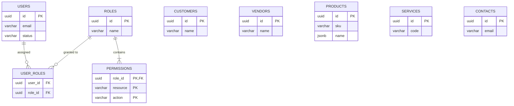
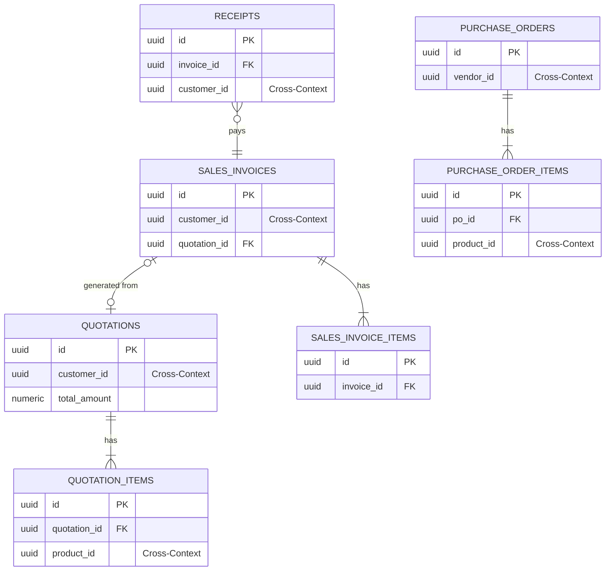
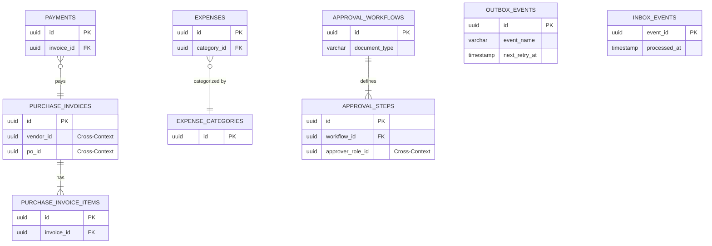

# VArrow AI Finance — Enterprise Entity Relationship Design (ERD)

| | |
|---|---|
| **Document** | Enterprise ERD |
| **Status** | Final |
| **Database** | PostgreSQL |
| **Architecture** | Modular Monolith (ADR-001) |
| **Date** | 2026-07-17 |

---

## About This Document

This document defines the Enterprise Entity Relationship Design (ERD) for the VArrow AI Finance platform. It is generated exclusively from the approved [Database Schema Specification](database-schema.md) and strict adherence to Domain-Driven Design (DDD) principles and approved ADRs.

---

## 1. High-Level ER Diagram

The entities are logically grouped by their owning Bounded Contexts (implemented as database schemas):

| Bounded Context | Core Entities |
|---|---|
| **Identity** (`identity`) | Users, Roles, Permissions |
| **Master Data** (`catalog`) | Customers, Vendors, Contacts, Products, Services |
| **Sales** (`sales`) | Quotations, Quotation Items, Sales Invoices, Sales Invoice Items, Receipts |
| **Procurement** (`procurement`) | Purchase Orders, Purchase Order Items |
| **Finance** (`finance`) | Purchase Invoices, Purchase Invoice Items, Expenses, Expense Categories, Employee Expenses, Payments, Petty Cash, Cash Flow, Currencies, Exchange Rates, Taxes |
| **Workflow Engine** (`workflow`) | Approval Workflows, Approval Steps |
| **Document Engine** (`document`) | Documents, Attachments, OCR Results |
| **AI Services** (`ai`) | AI Conversations, AI Prompts, AI Logs |
| **Reporting / Projects** (`project`)| Projects, Project Profitability |
| **Administration** (`admin`) | Settings, Audit Logs, Notifications |
| **Infrastructure** (`infra`) | Outbox Events, Inbox Events |

---

## 2. Detailed ERD

For every table, the PK, FKs, Cardinality, Relationship Type, and Ownership are defined.

### 2.1 Identity
- **Users**: PK `id`. Owns `user_roles`. 
- **Roles**: PK `id`. Owns `permissions`.
- **Permissions**: PK `(role_id, resource, action)`. FK `role_id` -> `Roles` (Cascade). One-to-Many from Roles.

### 2.2 Master Data / Catalog (Shared Kernel)
- **Products**: PK `id`. Independent Aggregate.
- **Services**: PK `id`. Independent Aggregate.
- **Contacts**: PK `id`. Independent Aggregate.
- **Customers**: PK `id`. Independent Aggregate.
- **Vendors**: PK `id`. Independent Aggregate.

### 2.3 Sales
- **Quotations**: PK `id`. FK `customer_id` (Cross-context reference to `catalog.customers`). Aggregate Root.
- **Quotation Items**: PK `id`. FK `quotation_id` -> `Quotations` (Cascade). One-to-Many from Quotation.
- **Sales Invoices**: PK `id`. FK `customer_id` (Cross-context). FK `quotation_id` (Nullable, internal reference). Aggregate Root.
- **Sales Invoice Items**: PK `id`. FK `invoice_id` -> `Sales Invoices` (Cascade). One-to-Many from Sales Invoice.
- **Receipts**: PK `id`. FK `customer_id` (Cross-context). FK `invoice_id` (Internal reference). Aggregate Root.

### 2.4 Procurement
- **Purchase Orders**: PK `id`. FK `vendor_id` (Cross-context reference to `catalog.vendors`). Aggregate Root.
- **Purchase Order Items**: PK `id`. FK `po_id` -> `Purchase Orders` (Cascade). One-to-Many from PO.

### 2.5 Finance
- **Purchase Invoices**: PK `id`. FK `vendor_id` (Cross-context). FK `po_id` (Cross-context reference to `procurement.purchase_orders`). Aggregate Root.
- **Purchase Invoice Items**: PK `id`. FK `invoice_id` -> `Purchase Invoices` (Cascade). One-to-Many from Purchase Invoice.
- **Payments**: PK `id`. FK `vendor_id` (Cross-context). FK `invoice_id` (Internal reference -> `Purchase Invoices`). Aggregate Root.
- **Expenses**: PK `id`. FK `category_id` (Internal reference). Aggregate Root.
- **Expense Categories**: PK `id`. Lookup table.
- **Employee Expenses**: PK `id`. `employee_id` (Cross-context UUID reference to `identity.users.id`, no physical FK). Aggregate Root.
- **Employee Expense Items**: PK `id`. FK `employee_expense_id` -> `Employee Expenses` (Cascade). FK `category_id` -> `Expense Categories` (Restrict). One-to-Many from Employee Expenses.
- **Petty Cash**: PK `id`. `custodian_id` (Cross-context UUID reference to `identity.users.id`, no physical FK). Aggregate Root.
- **Petty Cash Ledger**: PK `(id, created_at)`. FK `petty_cash_id` -> `Petty Cash` (Restrict). One-to-Many from Petty Cash. Partitioned.
- **Cash Flow**: Materialized View. No strict FKs.
- **Currencies**, **Exchange Rates**, **Taxes**: PK `id`. Lookup tables.

### 2.6 Workflow
- **Approval Workflows**: PK `id`. Aggregate Root.
- **Approval Steps**: PK `id`. FK `workflow_id` -> `Approval Workflows` (Cascade). FK `approver_role_id` / `approver_user_id` (Cross-context). One-to-Many from Workflow.

### 2.7 Documents
- **Attachments**: PK `id`. Polymorphic `record_id` (Cross-context reference). Aggregate Root.
- **OCR Results**: PK `id`. FK `attachment_id` -> `Attachments` (Cascade).

### 2.8 Administration & Infrastructure
- **Settings**: PK `id`. Aggregate Root.
- **Audit Logs**: PK `(id, created_at)` (Composite PK for partitioning). Immutable Ledger.
- **Notifications**: PK `id`. Aggregate Root.
- **Outbox Events**: PK `(id, created_at)` (Composite PK for partitioning). Event Log.
- **Inbox Events**: PK `event_id`. Idempotency tracking.

---

## 3. Aggregate Design

Aggregate boundaries are designed to strictly enforce transactional consistency without locking unrelated data.

- **Transaction Boundaries:** Transactions only guarantee consistency *within* a single Aggregate Root. For example, saving a `SalesInvoice` and its `SalesInvoiceItems` happens in a single ACID transaction. 
- **Consistency Boundaries:** Consistency *between* Aggregates (e.g., deducting an invoice balance when a `Receipt` is created) is eventually consistent, mediated by Domain Events via the Outbox table (ADR-003).

**Primary Aggregate Roots:**
- `User`: Manages user profile and authentication state.
- `Customer` / `Vendor` / `Product` / `Contact`: Master data lifecycle.
- `Quotation`: Manages quotation state and its line items.
- `SalesInvoice`: Manages billing state, tax totals, and invoice items.
- `PurchaseOrder`: Manages commitment to vendors and PO items.
- `PurchaseInvoice`: Manages vendor bills and matching to POs.
- `Receipt` / `Payment`: Independent aggregates that reference invoices to facilitate cash application.

---

## 4. Relationship Matrix

| Relationship Type | Example Entities | Implementation |
|---|---|---|
| **One-to-One** | `Attachment` to `OCR Result` | FK on OCR Result pointing to Attachment with a UNIQUE constraint. |
| **One-to-Many** | `SalesInvoice` to `SalesInvoiceItem` | FK on Item pointing to Invoice. Represented as Composition. |
| **Many-to-Many** | `User` to `Role` | Join table `user_roles(user_id, role_id)`. |
| **Composition** | `PurchaseOrder` + `POItem` | The Item has no meaning outside the PO. Hard database FK with `CASCADE` delete. |
| **Aggregation** | `SalesInvoice` + `Customer` | The Invoice belongs to the Customer, but the Customer exists independently. Implemented as a cross-context soft reference (UUID). |
| **Shared References** | `QuotationItem` + `Product` | A snapshot of product data is copied into the item. The UUID is kept as a loose reference to the Master Data catalog. |

---

## 5. Referential Integrity

| Policy | Where Used | Rationale |
|---|---|---|
| **Cascade Delete** | Internal Composition (`SalesInvoice` -> `SalesInvoiceItems`, `Role` -> `Permissions`) | If the parent aggregate is hard-deleted or purged, child items must be purged to prevent orphans. |
| **Restrict** | Lookup Tables (`Expense` -> `ExpenseCategory`) | Prevents deletion of a category if financial records still rely on it. |
| **Set Null** | Internal Aggregation (e.g., `SalesInvoice` -> `Quotation`) | If a quotation is purged, the invoice remains valid but loses the origin link. |
| **Soft Delete** | Primary Aggregates (`Users`, `Customers`, `Invoices`) | All domain aggregates use a `deleted_at` timestamp. Foreign keys remain intact, but application logic filters out deleted records. Financial data is never hard-deleted. |

---

## 6. Cross Context References

To support future migration to microservices, database-level Foreign Keys (`REFERENCES table(id)`) are **not** created across bounded context boundaries (schema boundaries).

| Source Schema | Target Schema | Reference Column | Why It Is Allowed |
|---|---|---|---|
| `sales` | `catalog` | `customer_id`, `product_id` | Master Data boundaries. Sales maintains local read-models synchronized via events. |
| `procurement` | `catalog` | `vendor_id`, `product_id` | Procurement maintains local read-models synchronized via events. |
| `finance` | `procurement` | `po_id` | Finance needs the PO ID to match vendor invoices, managed via UUID reference. |
| `finance` | `identity` | `employee_id`, `custodian_id` | Links expenses/petty cash to the owning user. |
| `workflow` | `identity` | `approver_user_id`, `approver_role_id`| Workflow steps target specific identities. |

*Mechanism:* These are stored as simple `UUID` columns without native PostgreSQL FK constraints. Consistency is verified via Application Layer logic or Event-Carried State Transfer.

---

## 7. Lookup Tables

Lookup tables store slowly changing reference data essential for validation and reporting:
- **Finance:** `currencies` (ISO codes, precision), `exchange_rates` (time-series rates), `taxes` (VAT rates), `expense_categories` (GL mapping).
- **Identity:** `roles`, `permissions`.
- **Administration:** `settings` (System-wide Key/Value JSON configs).

---

## 8. Event Related Tables

Critical infrastructure tables (ADR-003):
- **Outbox Events:** (`infrastructure.outbox_events`) — Stores published domain events transactionally. Includes `retry_count`, `dead_letter_at` for reliability.
- **Inbox Events:** (`infrastructure.inbox_events`) — Stores processed `event_id`s to ensure idempotent consumption.
- **Audit Logs:** (`administration.audit_logs`) — Immutable ledger of sensitive changes, driven by consumed events.
- **Notifications:** (`notification.notifications`) — Delivery status for emails/in-app alerts triggered by events.
- **AI Logs:** (`ai.ai_logs`) — Token usage and latency tracking for AI API calls.

---

## 9. Performance Considerations

| Optimization | Target Tables | Strategy |
|---|---|---|
| **High Volume / Growth** | `audit_logs`, `outbox_events`, `petty_cash_ledger` | Native PostgreSQL Range Partitioning by `created_at` (e.g., monthly). |
| **Indexing** | All Tables | B-Tree indexes on all UUID cross-context references (`customer_id`, `vendor_id`). |
| **Partial Indexes** | `outbox_events` | `WHERE dead_letter_at IS NULL` to speed up relay polling. |
| **GIN Indexes** | `products`, `settings`, `ocr_results` | Applied to `JSONB` columns for fast querying of nested keys/translations. |

---

## 10. Mermaid ER Diagram

*The ER Diagram is split into logical sections for readability.*

### Section 1: Identity & Master Data (Catalog)

### Section 2: Sales & Procurement

### Section 3: Finance, Workflow & Infrastructure

---

## 11. Future Scalability

- **Microservices Migration:** Because Aggregate Roots use soft UUID references rather than hard Database Foreign Keys across schemas, separating the schemas into physically isolated databases requires zero schema rewrites. Only the application logic configuration needs adjusting to map to new databases.
- **Database Partitioning:** Time-series tables (`audit_logs`, `outbox_events`) are natively partitioned to ensure index size remains manageable in memory, regardless of overall data growth.
- **Read Replicas:** Reporting features (e.g., Dashboards, Project Profitability, Financial Analytics) can easily connect to a PostgreSQL Read Replica to execute heavy aggregations without impacting transactional performance.
- **Future SaaS Migration Impact:** The base entities currently do not include a `tenant_id`. If the platform ever pivots to SaaS, a `tenant_id (UUID)` must be retrofitted into every table's Primary Key or unique indexes. As specified in ADR-003, events already reserve a `tenantId` field to accommodate this potential pivot gracefully.
