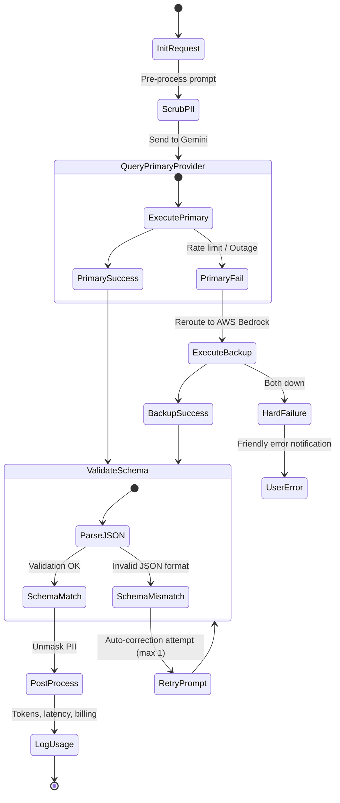

# VArrow AI Finance — AI / ML Architecture Design

| | |
|---|---|
| **Document** | AI / ML Architecture Design |
| **Status** | Final |
| **Phase** | Phase 1 — Detailed Design |
| **Architecture** | Modular Monolith (ADR-001) |
| **Date** | 2026-07-18 |

---

## 1. Architectural Goals & Design Principles

The AI architecture for VArrow AI Finance integrates artificial intelligence to reduce operational friction while maintaining institutional control. The design adheres to the following principles:

- **Human-in-the-Loop (HITL) (C-02, BR-20)**: The AI is an assistant, not an autonomous agent. Every AI output must be human-reviewable, human-editable, and human-approved before it affects any financial ledger.
- **Vendor Independence**: Core code must be decoupled from specific AI provider SDKs. Swap-out capabilities allow switching from Google Gemini to AWS Bedrock with zero changes to application controllers.
- **Data Privacy & PII Protection**: Sensitive financial and customer information must be protected. Masking protocols are applied before sending data to third-party endpoints.
- **Telemetry & Cost Control**: Every AI interaction must be audited, token counts logged, and latency monitored. Rate limits and budget ceilings are enforced at the service layer.

---

## 2. Provider Strategy & Model Abstraction Layer

To prevent vendor lock-in, the system implements a **Model Abstraction Layer** using NestJS provider injection.

```
       +---------------------------------------------+
       |            NestJS Application Core          |
       |  (OCR Service, Assistant, Categorization)    |
       +---------------------------------------------+
                              |
                              v
       +---------------------------------------------+
       |             Model Abstraction Port          |
       |           (IAIService Interface)            |
       +---------------------------------------------+
                              |
               +--------------+--------------+
               |                             |
               v                             v
+-----------------------------+ +-----------------------------+
|    GeminiProvider Adapter   | |    BedrockProvider Adapter  |
|  (Primary: Gemini 1.5 Pro)  | | (Fallback: Claude 3.5 Sonnet)
+-----------------------------+ +-----------------------------+
```

### 2.1 Model Selection Strategy
- **Primary AI Provider**: **Google Gemini 1.5 Pro / Flash**. Chosen for its native support of large context windows (up to 2 million tokens for invoice uploads), bilingual reasoning (English and Arabic), low latency, and competitive token pricing.
- **Secondary/Fallback Provider**: **AWS Bedrock (Claude 3.5 Sonnet / Haiku)**. Integrated as a hot-fallback. If Gemini API returns rate limits (`429`), timeouts, or outages (`5xx`), the abstraction layer immediately reroutes requests to AWS Bedrock.

### 2.2 Abstraction Interface (Port)
All AI requests route through a unified class interface:

```typescript
interface IAIService {
  generateText(request: AITextRequest): Promise<AITextResponse>;
  extractJSON<T>(request: AIJSONRequest, schema: ZodSchema<T>): Promise<T>;
  analyzeDocument(request: AIDocumentRequest): Promise<AIDocumentResponse>;
}
```

---

## 3. Core AI Use Cases

### 3.1 OCR Pipeline & Document Understanding (FR-057, FR-060)
- **OCR Engine**: Gemini 1.5 Flash is used as a multimodal reader. Uploaded files (PDFs, JPEGs, PNGs) are passed directly to the model as inline data blocks.
- **Bilingual Processing**: Supports invoices in English, Arabic, and mixed-language layouts (RTL structures combined with English SKUs).
- **Execution**: Runs asynchronously via NestJS background queue workers.

### 3.2 AI Invoice Validation & Three-Way Matching (FR-084)
- **Validation Rules**: The AI evaluates the uploaded vendor invoice against the associated Purchase Order (`purchase_orders` record) and the physical receipt record.
- **Checks**:
  - Compares unit quantities and pricing between PO items and invoice items.
  - Flags line-item pricing discrepancies exceeding a 1% variance threshold.
  - Verifies tax computations match localized rules.

### 3.3 AI Expense Categorization (FR-083)
- **Process**: When registering general expenses or employee claims, the AI inspects the line description and vendor metadata.
- **Outputs**: Recommends the top three matching General Ledger (GL) account codes from `finance.expense_categories` along with confidence ratios.

### 3.4 AI Anomaly Detection (FR-008, FR-073)
- **Execution**: Runs on payment authorizations and receipts.
- **Logic**: Flags:
  - Duplicated transaction IDs.
  - Unexpected payment frequencies (e.g. double billing).
  - Transactions departing significantly from historic customer/vendor baseline values.

### 3.5 AI Finance Assistant (FR-082)
- **Purpose**: Provides a conversational interface to query reports, draft quotations based on historical sales pipelines, and summarize audit logs.
- **Control**: Session-bounded, context-aware interaction history.

---

## 4. Prompt Management & Versioning Lifecycle

To prevent code bloat and support runtime optimization, prompts are managed as assets outside hardcoded code files.

```
       +---------------------------------------------+
       |             Administration Console          |
       |  - Write / Edit Prompts                     |
       |  - Set Active Versions                      |
       +---------------------------------------------+
                              |
                              v
       +---------------------------------------------+
       |            PostgreSQL Settings DB           |
       |          (administration.settings)          |
       +---------------------------------------------+
                              |
                              v
       +---------------------------------------------+
       |            NestJS Prompt Service            |
       |  - Load Prompt template                     |
       |  - Inject runtime values                    |
       |  - Return compiled string to Provider       |
       +---------------------------------------------+
```

### 4.1 Prompt Versioning Schema
Prompts are stored inside the `administration.settings` table as JSONB schemas:

```json
{
  "key": "prompt.ocr.invoice_extraction",
  "value": {
    "version": "1.2.0",
    "is_active": true,
    "system_instruction": "You are a professional financial auditor. Extract invoice data from the provided image.",
    "format_instruction": "Return ONLY a JSON block matching the schema. No markdown wrapping. No conversational filler.",
    "json_schema": {
      "type": "object",
      "properties": {
        "vendorName": {"type": "string"},
        "taxRegistrationNumber": {"type": "string"},
        "grandTotal": {"type": "number"}
      }
    }
  }
}
```

- **Prompt Lifecycle**:
  1. **Drafting**: Prompt created in Admin panel, assigned a draft tag (e.g., `1.3.0-rc1`).
  2. **Evaluation**: Prompts are tested in development against a static benchmark suite.
  3. **Release**: Prompt marked `is_active = true`, immediately replacing the active template without rebuilding or redeploying code.
  4. **Rollback**: If errors increase, the administrator reverts `is_active` to version `1.2.0` in the settings interface.

---

## 5. AI Request Lifecycle & Failure Handling



### 5.1 Retry & Fallback Logic
- **API Call Timeouts**: Requests to LLM APIs enforce a strict 15-second timeout window.
- **Provider Fallback**:
  - In the event of a `429` (Rate Limited) or `500` (Server Error) response from Google Gemini, the application logs the failure and switches to AWS Bedrock.
  - The fallback mechanism is active for 5 minutes before trying to reconnect to the primary provider.
- **JSON Structure Correction**:
  - If the model returns text that fails schema validation (e.g. Zod parsing errors), the service makes one automatic retry.
  - The retry request appends the validation error logs to the model system prompt, instructing it to fix the syntax.

---

## 6. Data Privacy, PII Protection, & Safety Guardrails

### 6.1 PII Protection Middleware
Before prompts are transmitted to external API endpoints, they pass through a local **PII Scrubbing Pipeline**:
1. **Extraction**: Identify names, personal email addresses, phone numbers, and physical home addresses from prompt inputs.
2. **Replacement**: Mask identified values with placeholder tokens (e.g., `John Doe` -> `[PARTNER_CONTACT_NAME_1]`).
3. **Tracking**: Store mappings in a transient local session map.
4. **Resolution**: When the LLM response is returned, the post-processor replaces the placeholder tokens with the original values.

### 6.2 Safety Guardrails
- **Prompt Injection Prevention**: User inputs are injected only inside explicit delimiter tags (e.g. `"""USER_INPUT_HERE"""`). System instructions explicitly forbid override commands within user input blocks.
- **Content Filtering**: Set safety thresholds on Gemini/Bedrock APIs to block toxic, offensive, or non-financial contexts.
- **System Constraints**: The system instructions restrict the model from answering queries unrelated to the business monolith's scope.

---

## 7. Human-in-the-Loop Workflow Integration

The system architecture prevents AI-driven actions from executing directly in the database.

```
       +---------------------------------------------+
       |               AI OCR Pipeline               |
       +---------------------------------------------+
                              |
                              v
       +---------------------------------------------+
       |          Write to Database (Pending)        |
       |  - status: 'PENDING_REVIEW'                 |
       |  - verified_by_user_id: NULL                |
       +---------------------------------------------+
                              |
                              v
       +---------------------------------------------+
       |             Human Accountant UI             |
       |  - View side-by-side (Original vs AI fields)|
       |  - Manual correction of field entries       |
       |  - Click "Approve & Verify"                 |
       +---------------------------------------------+
                              |
                              v
       +---------------------------------------------+
       |         Write to Transaction Ledger         |
       |  - status: 'VERIFIED'                       |
       |  - verified_by_user_id: [User UUID]         |
       +---------------------------------------------+
```

1. **Pending Validation State**: OCR-extracted records (e.g. purchase invoice items) are saved with status `PENDING_REVIEW` in `document.ocr_results`.
2. **Comparison View**: The UI renders a dual-pane editor: the original uploaded PDF on the left, and the AI-extracted fields on the right.
3. **Verification**: The user reviews, edits anomalies, and verifies. This action writes to the audit logs: `User [UUID] verified invoice data extracted by AI [Prompt ID]`.

---

## 8. Telemetry, Costs & Rate Limiting

### 8.1 Telemetry Logging (`ai.logs` Schema)
Every AI transaction writes to `ai.logs`:

| Column | Type | Description |
|---|---|---|
| `id` | `UUID` | Primary Key |
| `user_id` | `UUID` | Requesting User |
| `context_module` | `VARCHAR(50)`| Module context (e.g., `OCR`, `SALES`) |
| `provider` | `VARCHAR(20)`| `GEMINI` or `BEDROCK` |
| `model_name` | `VARCHAR(50)`| Specific model version used |
| `prompt_id` | `UUID` | Reference to prompt template version |
| `input_tokens` | `INTEGER` | Input billing tokens |
| `output_tokens`| `INTEGER` | Output billing tokens |
| `latency_ms` | `INTEGER` | Total API response delay |
| `user_action` | `VARCHAR(20)`| `ACCEPTED`, `REJECTED`, `EDITED` |

### 8.2 Rate Limiting
- **Global Rate Limiter**: Max 30 requests/minute per user.
- **OCR Queue limit**: Max 5 files processed concurrently to avoid model rate limit limits (`TPM` / `RPM` limits on developer tier models).

### 8.3 Cost Controls
- **Context Pruning**: Conversational assistant prompts truncate histories older than 10 turns.
- **Caching**: Prompt caching is enabled for system instructions and catalog descriptions.
- **Model Tiers**: Flash models are used for document sorting and categorization; Pro models are restricted to detailed invoice validations and financial audits.

---

## 9. Evaluation Strategy

The AI system is evaluated regularly to ensure performance and quality guidelines are met.

- **Golden Dataset**: A curated set of 200 bilingual financial documents (invoices, receipts, expenses) with verified ground-truth values.
- **Automated Regression Tests**:
  - Run weekly in the staging pipeline.
  - Measure Accuracy: Extract fields from the golden dataset and verify against ground truth.
  - Measure Hallucination rates: The system flags any response containing data items not found in the original document context.
- **Latency Testing**: Monitor p95 latency values. Alerts trigger if average execution times exceed target thresholds (e.g. OCR > 30 seconds).
- **User Acceptance Metrics**: Logs analyze the `user_action` field. If the prompt template edit rate exceeds 30% (users correcting the AI's suggestions), the prompt is flagged for revision.

---

## 10. Future RAG (Retrieval-Augmented Generation) Architecture

As the transaction history grows, the AI Center will transition to a **Retrieval-Augmented Generation (RAG)** architecture to search policies, historical quotations, and audit patterns.

```
                  [User Natural Query]
                           |
                           v
       +---------------------------------------------+
       |             Embedding Generator             |
       |            (text-embedding-004)             |
       +---------------------------------------------+
                              |
                              v
       +---------------------------------------------+
       |             Vector Search Engine            |
       |  - PostgreSQL with pgvector extension        |
       |  - Matches nearest semantic records         |
       +---------------------------------------------+
                              |
                              v
       +---------------------------------------------+
       |            Prompt Builder Context           |
       |  - Combines matched records + query         |
       +---------------------------------------------+
                              |
                              v
       +---------------------------------------------+
       |                   LLM Core                  |
       |  - Returns grounded response                |
       +---------------------------------------------+
```

- **Vector Database**: PostgreSQL using the `pgvector` extension.
- **Embeddings**: Generated using Google's `text-embedding-004` (or similar Bedrock embedding models).
- **Data Ingestion**: A listener monitors event pipelines (e.g. `Sales.QuotationCreated`). When triggered, it converts text to vectors and indexes them.
- **Context Filtering**: Semantic queries are filtered by user access scope before retrieval to ensure security isolation.

---

## 11. Cost Estimation

Expected expenses during development and production runtimes:

### 11.1 Development Phase (Gemini Free Tier & Developer Limits)
- Google AI Studio provides free limits for development (Gemini 1.5 Flash: 15 RPM, 1 million TPM, 1,500 RPD).
- Development run cost: **$0.00 / month** (under rate limits).

### 11.2 Production Operational Cost (10,000 Invoices/Month Estimate)

| Task | Volume | Model | Input Tokens / Inv | Output Tokens / Inv | Cost / Million (In/Out) | Total Monthly Cost |
|---|---|---|---|---|---|---|
| **Invoice OCR** | 10k pages | 1.5 Flash | ~10,000 | ~1,000 | $0.075 / $0.30 | **$10.80** |
| **Verification**| 10k checks | 1.5 Pro | ~15,000 | ~500 | $1.25 / $5.00 | **$212.50** |
| **Categorize** | 10k claims | 1.5 Flash | ~2,000 | ~200 | $0.075 / $0.30 | **$2.10** |
| **Assistant** | 5k prompts | 1.5 Flash | ~5,000 | ~1,000 | $0.075 / $0.30 | **$3.38** |
| **Total Estimated Cost**| | | | | | **~$228.78 / month**|

---

## 12. Future AI Roadmap

```
+-----------------------------------------------------------------------------+
| Phase 1: MVP (Months 1-3)                                                   |
| - Standard multimodal OCR (Gemini 1.5 Flash)                                |
| - Static prompt templates in database                                       |
| - Basic fallback mechanism (Gemini -> Bedrock)                              |
+-----------------------------------------------------------------------------+
                                      |
                                      v
+-----------------------------------------------------------------------------+
| Phase 2: Optimization (Months 4-6)                                          |
| - Automated regression tests using golden dataset                           |
| - Dynamic PII masking middleware                                            |
| - RAG pipeline for company policies and historical quotations              |
+-----------------------------------------------------------------------------+
                                      |
                                      v
+-----------------------------------------------------------------------------+
| Phase 3: Advanced Intelligence (Months 6+)                                  |
| - Anomaly detection models on cash flows                                    |
| - Offline OCR mobile fallback model (Gemini Nano)                           |
+-----------------------------------------------------------------------------+
```
