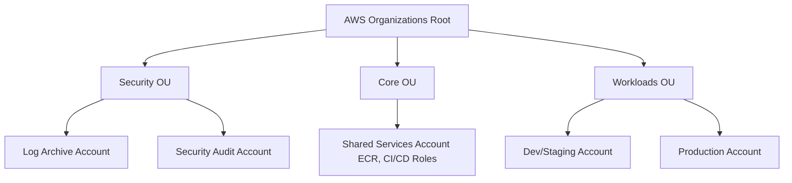

# VArrow AI Finance — AWS Infrastructure Architecture Design

| | |
|---|---|
| **Document** | AWS Infrastructure Architecture Design |
| **Status** | Final |
| **Phase** | Phase 1 — Detailed Design |
| **Architecture** | Modular Monolith (ADR-001) |
| **Date** | 2026-07-18 |

---

## 1. AWS Account Strategy

To guarantee absolute security boundaries, resource separation, and cost tracking, VArrow AI Finance employs a **Multi-Account Strategy** orchestrated via **AWS Organizations**. 



### 1.1 Account Segregation
- **Organizations Root**: Primary billing management, billing alerts, and consolidated invoicing. Minimal user footprint.
- **Security OU (Organizational Unit)**:
  - **Log Archive Account**: Central repository for all AWS CloudTrail, VPC Flow Logs, and system logs. Immutable, write-once-read-many (WORM) storage.
  - **Security Audit Account**: Read-only access for auditors and automated compliance tools (AWS Security Hub, GuardDuty).
- **Core/Shared OU**:
  - **Shared Services Account**: Houses the AWS Elastic Container Registry (ECR) for application images and global CI/CD cross-account IAM roles.
- **Workloads OU**:
  - **Dev/Staging Account**: Houses developer resources, sandbox deployments, and staging environments to validate changes.
  - **Production Account**: Highly locked down, multi-AZ production workload. No human access by default (access only via automated CI/CD pipelines or emergency break-glass procedures).

---

## 2. IAM Roles and Policies

The architecture adheres strictly to the **Principle of Least Privilege (PoLP)**. Permissions are granted explicitly and deny-by-default is enforced globally.

### 2.1 Human Access Strategy (IAM Identity Center)
- Direct creation of IAM Users is **prohibited** in Dev, Staging, and Production accounts.
- Access is managed via **AWS IAM Identity Center** (successor to AWS SSO) integrated with the company's identity provider.
- Permission sets map to roles defined in our organizational policies:
  - `AdministratorAccess`: Reserved for Emergency Break-Glass roles (monitored and alerted).
  - `ReadOnlyAccess`: For developers, sales, and support staff to troubleshoot in Dev/Staging.
  - `DatabaseAuditRole`: For auditors to inspect DB settings.

### 2.2 Application Identity (IAM Roles for Compute)
The application NestJS processes utilize instance profiles (EC2) or Task Execution Roles (ECS) to interact with AWS services, bypassing static IAM credential keys.

```yaml
# Compute IAM Execution Permissions
TaskExecutionRole:
  Purpose: "Granted to the ECS Agent / EC2 Helper to spin up and fetch secrets"
  Permissions:
    - ecr:GetAuthorizationToken
    - ecr:BatchCheckLayerAvailability
    - ecr:GetDownloadUrlForLayer
    - logs:CreateLogStream
    - logs:PutLogEvents
    - secretsmanager:GetSecretValue (Restricted to App Secrets ARN)
    - kms:Decrypt (Restricted to App Secrets KMS Key ARN)

TaskRole:
  Purpose: "Granted to the running NestJS application code container"
  Permissions:
    - s3:PutObject (Restricted to docs bucket /attachments/*)
    - s3:GetObject (Restricted to docs bucket /attachments/*)
    - s3:DeleteObject (Restricted to docs bucket /attachments/*)
    - ses:SendEmail (Restricted to verified sender domains)
    - bedrock:InvokeModel (Optional: For AI Center prompts)
```

---

## 3. Networking (VPC, Subnets, Security Groups)

The network architecture separates the public interface, application logic, and database storage into isolated network tiers across multiple Availability Zones (AZs).

```
+-----------------------------------------------------------------------------------+
| VPC (10.0.0.0/16)                                                                 |
|                                                                                   |
|  +-------------------------------------+   +-------------------------------------+|
|  | Availability Zone A                 |   | Availability Zone B                 ||
|  |                                     |   |                                     ||
|  |  [Public Subnet 1] (10.0.1.0/24)    |   |  [Public Subnet 2] (10.0.2.0/24)    ||
|  |  * Application Load Balancer (ALB)  |   |  * Application Load Balancer (ALB)  ||
|  |  * NAT Gateway (Prod only)          |   |  * NAT Gateway (Backup)             ||
|  |                 |                   |   |                 |                   ||
|  +-----------------|-------------------+   +-----------------|-------------------+|
|                    v                                         v                    |
|  +-------------------------------------+   +-------------------------------------+|
|  | [Private App Subnet 1] (10.0.10.0/24)|   | [Private App Subnet 2] (10.0.11.0/24)|
|  |  * NestJS ECS Fargate Container     |   |  * NestJS ECS Fargate Container     ||
|  |                 |                   |   |                 |                   ||
|  +-----------------|-------------------+   +-----------------|-------------------+|
|                    v                                         v                    |
|  +-------------------------------------+   +-------------------------------------+|
|  | [Isolated DB Subnet 1] (10.0.20.0/24)|   | [Isolated DB Subnet 2] (10.0.21.0/24)|
|  |  * RDS PostgreSQL Primary           |   |  * RDS PostgreSQL Standby (Replica) ||
|  +-------------------------------------+   +-------------------------------------+|
+-----------------------------------------------------------------------------------+
```

### 3.1 Subnet Allocation
- **Public Subnets (2x)**: For Public Application Load Balancers (ALBs) and NAT Gateways. Route tables route `0.0.0.0/0` traffic directly to the Internet Gateway (IGW).
- **Private Application Subnets (2x)**: For Fargate containers or EC2 compute hosts. Private route tables route internet-bound traffic through the NAT Gateway. No inbound access is permitted directly from the internet.
- **Isolated Database Subnets (2x)**: For RDS PostgreSQL DB clusters. No routes exist to the internet or NAT Gateways. Accessible ONLY from the Application Subnets.

### 3.2 Security Group Controls
Strict security group chaining rules are enforced:

```
[Internet] 
    --> ALB SG (Inbound: 80, 443; Outbound: App SG 3000)
        --> App SG (Inbound: ALB SG 3000; Outbound: DB SG 5432, S3, Secrets Manager, Bedrock/Gemini)
            --> DB SG (Inbound: App SG 5432; Outbound: None)
```

---

## 4. Compute Strategy

The compute infrastructure is designed to start on a low-cost, free-tier eligible footprint during development and seamlessly scale to serverless container orchestration in production.

### 4.1 Development/Staging Phase (Single Instance Model)
- **EC2 Instance**: A single `t3.micro` or `t3.small` instance is deployed within the workload account's private subnet.
- **Reverse Proxy**: Nginx is installed on the host (or within a container) inside the public subnet to handle SSL termination and route requests to the NestJS application container.
- **Deployment**: Docker Compose orchestrates the NestJS container and background outbox relay.
- **Free Tier Eligibility**:
  - `t2.micro` or `t3.micro` EC2 instances are 100% free under the AWS Free Tier (750 hours/month for the first 12 months).

### 4.2 Production Roadmap (ECS Fargate Serverless)
For production, the EC2 instance is replaced by **AWS Elastic Container Service (ECS) running on AWS Fargate**:
- **Serverless Compute**: No VMs or operating systems to manage, patch, or secure. CPU and memory are allocated at the task level.
- **Application Load Balancer (ALB)**: Public ALB distributes incoming traffic across multiple Fargate tasks running in different AZs.
- **Auto Scaling**: Compute tasks scale out based on target tracking policies (e.g. scale when average CPU utilization exceeds 70%).

---

## 5. Database Strategy (PostgreSQL)

The database matches the guidelines set in our Database Schema and ADR-004, enforcing schema isolation within a single managed database cluster.

### 5.1 Development Database (Free-Tier Optimized)
- **Engine**: AWS RDS PostgreSQL 16+.
- **Instance Class**: `db.t3.micro` (Free-Tier eligible: 750 hours/month, 20GB SSD General Purpose storage).
- **Configuration**: Single-AZ deployment. High availability is disabled during dev/test to avoid extra fees.

### 5.2 Production Migration Path (High Availability)
- **Engine**: AWS RDS PostgreSQL 16+ Multi-AZ.
- **Multi-AZ Replication**: Synchronous replication to a standby instance in a different AZ, ensuring automatic failover with zero manual intervention.
- **Read Replicas**: An asynchronous read replica is provisioned in the isolated subnets to offload intensive analytics and reporting queries (`GET /api/v1/finance/cash-flow`, `GET /api/v1/reports/*`) from the primary write database.
- **Storage Auto-Scaling**: Enabled with a maximum threshold of 1TB to avoid disk-exhaustion outages.
- **Database Partitioning**: Supports range partitioning (by `created_at` monthly intervals) on heavy transactional tables: `infrastructure.outbox_events` and `administration.audit_logs`.

---

## 6. Storage Strategy (S3)

Document attachments, OCR templates, and static assets are stored in **Amazon S3** buckets.

### 6.1 Bucket Strategy & Lifecycle Rules
To support the 7-year retention policy (NFRS-COM-002) cost-effectively:
- **Bucket naming**: `varrow-finance-documents-[env]`
- **Encryption**: Enforce SSE-KMS (AWS Managed KMS Key) for all uploads.
- **Access Protocol**: Public access is completely blocked (`Block Public Access` enabled). All downloads occur using **S3 Pre-signed URLs** (5-minute TTL) generated dynamically by the NestJS app (SRS-DOC-001).
- **Lifecycle Configuration**:
  ```
  [0 - 1 Year]   --> S3 Standard (Active access, OCR reviews)
  [1 - 3 Years]  --> Transition to S3 Glacier Instant Retrieval (Immediate access for historical audit logs)
  [3 - 7 Years]  --> Transition to S3 Glacier Deep Archive (Cost-optimized archive for legal compliance)
  [> 7 Years]    --> Permanent deletion (unless active legal hold exists)
  ```

---

## 7. Secrets Management

Hardcoded application credentials or configuration files in git repositories are strictly prohibited.

- **AWS Secrets Manager**: Stores DB passwords, JWT signing keys, third-party API keys (e.g., Gemini API, Bedrock models, SES credentials).
- **Integration**: During startup, the NestJS configuration module executes a call to AWS Secrets Manager to fetch secrets into memory. No secrets are written to disk or container environments.
- **Rotation**: Auto-rotation is configured for database master credentials using built-in AWS Lambda rotation templates.
- **KMS Control**: Access to decrypt Secrets Manager values is locked behind custom KMS policies restricted to the application's IAM `TaskExecutionRole` (see §2.2).

---

## 8. CloudWatch Logging & Monitoring

Monitoring is critical to detect and trace issues, especially for our Transactional Outbox relay performance.

### 8.1 Log Collection (AWS CloudWatch Logs)
- NestJS uses structured JSON logs (Winston logger) written to stdout, captured by AWS Fargate (or EC2 agent), and streamed to `/aws/ecs/varrow-finance-[env]`.
- PostgreSQL logs (slow queries, errors) are streamed directly from RDS to `/aws/rds/varrow-finance-db-[env]`.

### 8.2 Metric Filters & Alarms
CloudWatch alarms trigger real-time notifications via AWS SNS to slack/email endpoints:

| Alarm Metric | Trigger Condition | Rationale |
|---|---|---|
| **CPU Utilization** | > 80% for 5 minutes | Scale compute tasks (horizontal scale out) |
| **Outbox Queue Lag** | `OutboxRelayLag` > 10s | Alerts when event relay falls behind polling interval |
| **HTTP 5XX Errors** | > 10 in 1 minute | Alerts on system degradation / runtime errors |
| **Database Connections**| > 85% capacity | DB connection leak detection |
| **Dead Letter Queue** | `DLQCount` >= 1 | Outbox event delivery failed after retries |

---

## 9. SES Email Service

All email communications (approval notifications, billing reminders, password resets) are routed through **Amazon SES**.

- **Sandboxed Mode**: During development, SES is kept in sandbox mode, restricting outputs to verified test addresses.
- **Production Verification**: Verification of the domain using DKIM, SPF, and DMARC records on Route 53.
- **SES Reputation Management**: Dedicated CloudWatch alerts monitor bounce rates (> 5%) and complaint rates (> 0.1%) to protect domain sending reputation.

---

## 10. Backup & Disaster Recovery

The DR strategy targets an **RTO (Recovery Time Objective) of < 4 hours** and an **RPO (Recovery Point Objective) of < 5 minutes**.

### 10.1 RDS Backups (Continuous & PITR)
- **Continuous Backups**: AWS RDS automated backups enabled with a 35-day retention period.
- **Point-in-Time Recovery (PITR)**: Enabled, allowing restoration of the database cluster to any second within the retention window.
- **Cross-Region Snapshots**: Production DB snapshots are copied nightly to a secondary AWS region (disaster recovery destination).

### 10.2 S3 Bucket Backups
- **Versioning**: Object versioning is enabled on the document bucket to protect against accidental edits or deletes.
- **Replication**: S3 Cross-Region Replication (CRR) automatically duplicates document uploads to an isolated backup bucket in the secondary region.

---

## 11. CI/CD Pipeline (GitHub Actions)

The deployment pipeline is fully automated. Code modifications are integrated, compiled, and deployed using **GitHub Actions**.

```
[Git Push to main]
    --> Run Linter, Formatter & Unit Tests
        --> Authenticate to AWS via OIDC (Role Assumption)
            --> Build Docker Container (Multi-stage)
                --> Push Image to Amazon ECR (Shared Services)
                    --> Update ECS Task Definition
                        --> Deploy Tasks (Rolling Update 100% min / 200% max)
```

### 11.1 Key Pipeline Features
- **Keyless AWS Authentication**: GitHub Actions assumes AWS roles via **OIDC** (OpenID Connect ID Provider), eliminating the need to store long-lived `AWS_ACCESS_KEY_ID` or `AWS_SECRET_ACCESS_KEY` credentials in GitHub secrets.
- **Rolling Deployments**: ECS executes rolling updates, maintaining existing tasks until new containers pass health checks, preventing downtime during updates.
- **ECR Lifecycle**: Unused docker images are pruned after 30 days to limit storage costs.

---

## 12. Environment Strategy

We maintain four distinct environments:

| Environment | Purpose | Infrastructure Config | Data Layer |
|---|---|---|---|
| **Local** | Local Developer Workstations | Local PC / Docker Compose | SQLite or local Postgres container |
| **Dev** | Feature integration / Sandbox | AWS EC2 (`t3.micro`) + Single NAT | Single-AZ RDS Postgres (`db.t3.micro`) |
| **Staging** | Production-equivalent validation | AWS ECS Fargate + ALB + NAT | Single-AZ RDS Postgres (`db.t3.medium`) |
| **Production**| Serving live customers | AWS ECS Fargate + ALB + Multi-AZ NAT | Multi-AZ RDS Postgres + Read Replica |

---

## 13. Cost Optimization (Free Tier & Low Cost)

Operating costs are strictly controlled, especially during initial development phases.

### 13.1 Free Tier Target Footprint (Dev Environment)

| Service | Dev Configuration | Estimated Cost | Free Tier Allocation |
|---|---|---|---|
| **EC2** | 1x `t3.micro` instance | **$0.00** | 750 hours/month (first 12 months) |
| **RDS** | 1x `db.t3.micro` database | **$0.00** | 750 hours/month (first 12 months) |
| **S3** | Up to 5GB storage | **$0.00** | 5GB Standard storage free (first 12 months)|
| **SES** | < 3,000 emails/month | **$0.00** | 3,000 messages free/month (always free tier)|
| **Secrets Manager**| 3 Secrets | **$1.20 / mo** | 30 days free per secret |
| **CloudWatch** | Basic metrics & logs | **$0.00** | 5GB logs, 10 alarms free (always) |
| **Total Dev Cost**| | **~$1.20 / mo**| |

### 13.2 Cost Saving Strategies
- **NAT Gateway Bypass in Dev**: AWS charge for NAT Gateways is ~$32/month per gateway. In the Dev environment, we deploy a lightweight **NAT Instance** (using a `t3.nano` instance running standard iptables NAT) to connect private subnets to the internet, reducing costs by 90%.
- **Automatic Resource Scheduling**: A Lambda script stops Dev EC2 instances and RDS databases outside business hours (18:00 to 07:00 AST, and weekends), reducing run costs by ~65%.
- **ECR Image Expiry**: Automate deletion of untagged images in ECR to maintain minimal storage fees.

---

## 14. Scaling Strategy

As workload demands increase, infrastructure scales dynamically:

### 14.1 Horizontal Compute Scaling (ECS Fargate)
- Tasks scale out horizontally when average CPU usage > 70% or memory usage > 80% for 3 consecutive minutes.
- Tasks scale in when average CPU usage drops below 30% for 10 minutes.
- Rolling updates ensure new tasks boot, complete health checks, and register with the ALB before older tasks are terminated.

### 14.2 Database Scaling
- **Vertical scale**: Move instance class from `db.t3.micro` to memory-optimized classes (`db.r6g.xlarge`) during scheduled maintenance.
- **Horizontal scale**: Offload search queries and heavy read operations (cash flow compiles) to RDS Read Replicas (up to 5 replicas supported).
- **Storage Auto-Scaling**: Enabled dynamically up to 1TB.

---

## 15. Security Best Practices

Security is integrated into every layer of the infrastructure design:

- **SSM Session Manager**: No ports are opened for SSH (port 22) on compute instances. Administrators connect securely using AWS Systems Manager (SSM) Session Manager, providing complete command audit trails.
- **Encryption Enforcement**: SSL is enforced at the database level (`rds.force_ssl=1`). S3 buckets reject any uploads missing headers for KMS-based server-side encryption.
- **Secure Cross-Context references**: No physical database links are allowed across context schemas.
- **Secrets Encryption**: Secrets Manager entries are encrypted via custom Customer Managed Keys (CMKs) in KMS.
- **AWS WAF (Web Application Firewall)**: Attached to the ALB in Production to block common vulnerabilities (SQL injection, XSS) and restrict access to malicious IP addresses.

---

## 16. AWS Services Used: Now vs. Future

| AWS Service | Stage 1 (Dev / MVP) | Stage 2 (Production Scale) | Chosen Reason |
|---|---|---|---|
| **EC2** | Yes (Dev VM) | Bastion only | Low cost dev VM, transitions to serverless |
| **ECS Fargate**| No | Yes | Serverless container runtime, zero VM management |
| **RDS PostgreSQL**| Yes (Single-AZ) | Yes (Multi-AZ + Replica)| Relational storage with schema segregation |
| **S3** | Yes | Yes | Scalable object storage with Glacier archive |
| **Secrets Manager**| Yes | Yes | Secure config management, auto-rotation |
| **CloudWatch** | Yes | Yes | Centralized telemetry, logging, and alerts |
| **SES** | Yes | Yes | Transactional email notification delivery |
| **IAM** | Yes | Yes | Identity controls & OIDC pipeline access |
| **ALB** | No | Yes | Layer 7 routing, Multi-AZ routing |
| **KMS** | Yes | Yes | Encryption at rest control |
| **WAF** | No | Yes | Edge request filtering and threat protection |
| **DMS** | No | Yes (Archival) | Moves expired DB rows to cold storage (7+ years) |
